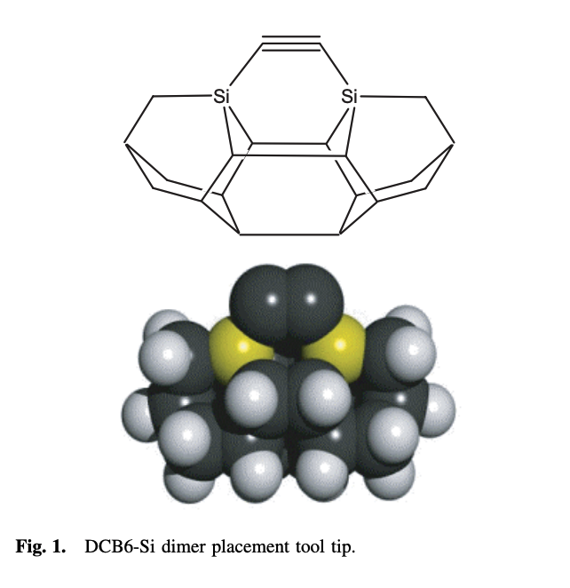
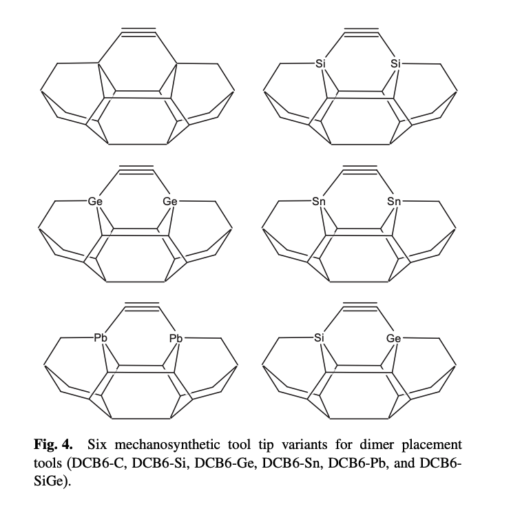

# Studies of Diamond Mechanosynthesis and Computational Methods Employed

Philip Turner

<i>Independent Research, December 2023</i>

## Introduction

This literature review was created to investigate computational methods used to study mechanosynthesis. It only covers documents published by Robert Freitas, Jr. Before conducting the review, the author learned that density functional theory (DFT) is the dominant simulation algorithm.

Data:
- Each instance of supercomputer use should be thoroughly documented. 
- Estimate quantitative data such as compute power (FLOPS) and compute cost (FLOPs) for each isolated simulation.
- Look for places where lower levels of theory could be used, such as semiempirical quantum mechanics instead of density functional theory.

Insights:
- Typical system sizes used in simulations (number of atoms, number of electrons) and parallelism (number of simulations executing concurrently).
- Inherent lack of parallelism in certain algorithms or at small system sizes (compute power per isolated simulation).
- Rough quantification of energy error for different levels of theory, and what amount of error is tolerable.

There are 18 research papers and 14 patent variants. Every research paper will be summarized in depth, but the patents will only be summarized in final form. Any interesting modifications since the first variant will be noted. Papers are sorted by date of publication, while patents are sorted by date of filing.

Contents:
- Papers:
  - [x] [Theoretical Analysis of a Carbon-Carbon Dimer Placement Tool for Diamond Mechanosynthesis](#2003--theoretical-analysis-of-a-carbon-carbon-dimer-placement-tool-for-diamond-mechanosynthesis)
  - [ ] A Simple Tool for Positional Diamond Mechanosynthesis, and its Method of Manufacture
  - [ ] Theoretical Analysis of Diamond Mechanosynthesis. Part I. Stability of C2 Mediated Growth of Nanocrystalline Diamond C(110) Surface
  - [ ] Theoretical Analysis of Diamond Mechanosynthesis. Part II. C2 Mediated Growth of Diamond C(110) Surface via Si/Ge-Triadamantane Dimer Placement Tools
  - [ ] Theoretical Analysis of Diamond Mechanosynthesis. Part III. Positional C2 Deposition on Diamond C(110) Surface using Si/Ge/Sn-based Dimer Placement Tools
- Patents:
  - [ ] Atomically-Precise Products and Methods and Systems for Manufacturing the Same
  - [ ] Systems and Methods for Mechanosynthesis

## Research Papers

Robert Freitas first started researching diamond mechanosynthesis in 2003, in collaboration with Ralph Merkle. He published several papers, most in the _Journal of Computational and Theoretical Nanoscience_. The trail of papers stopped abruptly in 2013. This was the same year that Freitas and Merkle published a precursor to one of the CBN patents. The document, US20130178626, was abandoned after the patent office received no response in 2017.

Some of these references include patents awarded to Zyvex. This time span in the patent timeline shall be referred to as the “Zyvex Era”. The next round of patent literature is the “CBN Era”. Only the latter is documented in the next section.

| Years | Activity |
| :---: | :------" |
| 1996&ndash;2003 | <b>Nanomedicine</b>, Vol. 1 & 2A |
| 2003&ndash;2010 | <b>Mechanosynthesis</b>, "Zyvex Era" |
| 2010&ndash;2012 | <b>Mechanosynthesis</b>, Kazan Federal University |
| 2012&ndash;2015 | <b>Nanomedicine</b>, Vol. 2B & 3 (Unpublished) |
| 2016&ndash;Present\* | <b>Mechanosynthesis</b>, "CBN Era" |
| 2020&ndash;2022 | <b>Nanomedicine</b>, Cryostasis Revival |

_Rough timeline categorizing Robert Freitas’s activity in published literature. *There is a ~2 year delay between patent filing and granting. Patents created in 2022 will not materialize until roughly 2024._

Literature:

1. Ralph C. Merkle, Robert A. Freitas Jr., “Theoretical analysis of a carbon-carbon dimer placement tool for diamond mechanosynthesis,” **_J. Nanosci. Nanotechnol._** 3(August 2003):319-324. [PubMed Abstract (HTML)](http://www.ncbi.nlm.nih.gov/entrez/query.fcgi?cmd=Retrieve&db=pubmed&dopt=Abstract&list_uids=14598446&query_hl=1) ..... [Conference Abstract (HTML)](http://www.foresight.org/Conferences/MNT10/Abstracts/Merkle/index.html) ..... [Full Paper (PDF)](http://www.molecularassembler.com/Papers/JNNDimerTool.pdf) ..... [Full Paper (HTML)](http://www.rfreitas.com/Nano/DimerTool.htm) ..... [Full Paper (PDF)](http://www.rfreitas.com/Nano/JNNDimerTool.pdf)
2. Robert A. Freitas Jr., “A Simple Tool for Positional Diamond Mechanosynthesis, and its Method of Manufacture,” U.S. Provisional Patent Application No. 60/543,802, filed 11 February 2004; **U.S. Patent Pending**, 11 February 2005. [Full Paper (HTML, 1.0 MB](http://www.molecularassembler.com/Papers/DMSToolbuildProvPat.htm)) ..... [See Also (HTML)](http://www.kurzweilai.net/articles/art0632.html)
3. Jingping Peng, Robert A. Freitas Jr., Ralph C. Merkle, “Theoretical Analysis of Diamond Mechanosynthesis. Part I. Stability of C2 Mediated Growth of Nanocrystalline Diamond C(110) Surface,” **_J. Comput. Theor. Nanosci._** 1(March 2004):62-70. [Full Text (PDF, 3.1 MB)](http://www.molecularassembler.com/Papers/JCTNPengMar04.pdf)
4. David J. Mann, Jingping Peng, Robert A. Freitas Jr., Ralph C. Merkle, “Theoretical Analysis of Diamond Mechanosynthesis. Part II. C2 Mediated Growth of Diamond C(110) Surface via Si/Ge-Triadamantane Dimer Placement Tools,” **_J. Comput. Theor. Nanosci._** 1(March 2004):71-80. [Full Text (PDF, 2.1 MB)](http://www.molecularassembler.com/Papers/JCTNMannMar04.pdf)
5. Jingping Peng, Robert A. Freitas Jr., Ralph C. Merkle, James R. Von Ehr, John N. Randall, George D. Skidmore, “Theoretical Analysis of Diamond Mechanosynthesis. Part III. Positional C2 Deposition on Diamond C(110) Surface using Si/Ge/Sn-based Dimer Placement Tools,” **_J. Comput. Theor. Nanosci._** 3(February 2006):28-41. [Full Paper (PDF, 1.0 MB)](http://www.molecularassembler.com/Papers/JCTNPengFeb06.pdf)
6. Berhane Temelso, C. David Sherrill, Ralph C. Merkle, Robert A. Freitas Jr., “High-level _Ab Initio_ Studies of Hydrogen Abstraction from Prototype Hydrocarbon Systems,” **_J. Phys. Chem. A_** 110 (28 September 2006):11160-11173. [ACS Abstract (HTML)](http://pubs.acs.org/doi/abs/10.1021/jp061821e) ..... [PubMed Abstract (HTML)](http://www.ncbi.nlm.nih.gov/pubmed/16986851) ..... [Full Paper (PDF, 0.4 MB)](http://www.molecularassembler.com/Papers/TemelsoHAbst.pdf)
7. Robert A. Freitas Jr., Damian G. Allis, Ralph C. Merkle, “Horizontal Ge-Substituted Polymantane-Based C2 Dimer Placement Tooltip Motifs for Diamond Mechanosynthesis,” **_J. Comput. Theor. Nanosci._** 4(May 2007):433-442. [Ingenta Abstract (HTML)](http://openurl.ingenta.com/content?genre=article&issn=1546-1955&volume=4&issue=3&spage=433&epage=442) ..... [Full Paper (PDF, 0.7 MB)](http://www.molecularassembler.com/Papers/DPTMotifs.pdf)
8. D.R. Forrest, R.A. Freitas Jr., N. Jacobstein, “Scanning Probe Diamondoid Mechanosynthesis,” **_IMM White Paper_,** 1 August 2007.  [http://www.imm.org/documents/IMM_Roadmap_DMS.pdf](http://www.imm.org/documents/IMM_Roadmap_DMS.pdf)
9. Berhane Temelso, C. David Sherrill, Ralph C. Merkle, Robert A. Freitas Jr., “_Ab Initio_ Thermochemistry of the Hydrogenation of Hydrocarbon Radicals Using Silicon, Germanium, Tin and Lead Substituted Methane and Isobutane,” **_J. Phys. Chem. A_** 111(15 August 2007):8677-8688. [ACS Abstract (HTML)](http://pubs.acs.org/doi/abs/10.1021/jp071797k) ..... [PubMed Abstract (HTML)](http://www.ncbi.nlm.nih.gov/pubmed/17696410) ..... [Full Paper (PDF, 0.2 MB)](http://www.molecularassembler.com/Papers/TemelsoHDon.pdf)
10. Robert A. Freitas Jr., Ralph C. Merkle, “Positional Diamond Mechanosynthesis: Toolset, Reactions, Uses and Products,” **_U.S. Provisional Patent_** Application No. 60/970,658, filed 7 September 2007. [Abstract (HTML)](http://www.molecularassembler.com/Nanofactory/AnnBibDMS.htm#FreitasMerkle07)
11. Robert A. Freitas Jr., Ralph C. Merkle, “A Minimal Toolset for Positional Diamond Mechanosynthesis,” **_J. Comput. Theor. Nanosci._** 5(May 2008):760-861. [Abstract (HTML)](http://www.molecularassembler.com/Nanofactory/AnnBibDMS.htm#FreitasMerkle07) ..... [Full Paper (PDF, 6.5 MB)](http://www.molecularassembler.com/Papers/MinToolset.pdf)
12. Denis Tarasov, Natalia Akberova, Ekaterina Izotova, Diana Alisheva, Maksim Astafiev, Robert A. Freitas Jr., “Optimal Tooltip Trajectories in a Hydrogen Abstraction Tool Recharge Reaction Sequence for Positionally Controlled Diamond Mechanosynthesis,” **_J. Comput. Theor. Nanosci._** 7(February 2010):325-353. [Abstract (HTML)](http://www.ingentaconnect.com/content/asp/jctn/2010/00000007/00000002/art00002?token=003c119766720297d7634257b3a4a5f7a6c425957316d3f4e4b25f253d8a) ..... [Full Paper (PDF, 3.2 MB)](http://www.molecularassembler.com/Papers/TarasovFeb2010.pdf)
13. Robert A. Freitas Jr., “A Simple Tool for Positional Diamond Mechanosynthesis, and its Method of Manufacture,” **_U.S. Patent No. 7,687,146_**, issued 30 March 2010. [US7687146 (PDF, 1.2 MB, 68 pp)](http://www.molecularassembler.com/Papers/US7687146.pdf) ..... [USPTO (HTML)](http://patft.uspto.gov/netacgi/nph-Parser?Sect1=PTO1&Sect2=HITOFF&d=PALL&p=1&u=%2Fnetahtml%2FPTO%2Fsrchnum.htm&r=1&f=G&l=50&s1=7,687,146.PN.&OS=PN/7,687,146&RS=PN/7,687,146) ..... [FreePatentsOnline (HTML)](http://www.freepatentsonline.com/7687146.html) ..... [FreePatentsOnline (PDF)](http://www.freepatentsonline.com/7687146.pdf)
14. Denis Tarasov, Ekaterina Izotova, Diana Alisheva, Natalia Akberova, Robert A. Freitas Jr., “Structural Stability of Clean, Passivated, and Partially Dehydrogenated Cuboid and Octahedral Nanodiamonds up to 2 Nanometers in Size,” **_J. Comput. Theor. Nanosci._** 8(February 2011):147-167. [Abstract ](http://openurl.ingenta.com/content?genre=article&issn=1546-1955&volume=8&issue=2&spage=147&epage=167)..... [Full Paper (PDF, 2.2 MB, uncorrected proof)](http://www.molecularassembler.com/Papers/TarasovFeb2011.pdf)
15. Damian G. Allis, Brian Helfrich, Robert A. Freitas Jr., Ralph C. Merkle, “Analysis of Diamondoid Mechanosynthesis Tooltip Pathologies Generated via a Distributed Computing Approach,” **_J. Comput. Theor. Nanosci._** 8(July 2011):1139-1161. [Abstract](http://www.ingentaconnect.com/content/asp/jctn/2011/00000008/00000007/art00009;jsessionid=2hlje6ca886m.victoria) ..... [Full Paper (PDF, 2.1 MB, uncorrected proof)](http://www.molecularassembler.com/Papers/AllisHelfrichFreitasMerkle2011.pdf) ..... [Full Paper (PDF, 1 MB)](https://web.archive.org/web/20150623233148/http://www.imre.a-star.edu.sg/htmleditor/uploadfile/20100701101136787.pdf)
16. Robert A. Freitas Jr., “Chapter 11. Diamondoid Mechanosynthesis for Tip-Based Nanofabrication,” in Ampere Tseng, ed., **_Tip-Based Nanofabrication: Fundamentals and Applications_**, Springer, New York, 2011, pp. 387-400. [Purchase Book (Amazon) ](http://www.amazon.com/Tip-Based-Nanofabrication-Fundamentals-Ampere-Tseng/dp/1441998985)..... [Full Paper (PDF, 0.4 MB)](http://www.molecularassembler.com/Papers/Freitas-Tseng2011.pdf)
17. Denis Tarasov, Ekaterina Izotova, Diana Alisheva, Natalia Akberova, Robert A. Freitas Jr., “Structural Stability of Clean and Passivated Nanodiamonds having Ledge, Step, or Corner Features,” **_J. Comput. Theor. Nanosci._** 9(January 2012):144-158. [Abstract](http://www.ingentaconnect.com/content/asp/jctn/2012/00000009/00000001/art00023) ..... [Full Paper (PDF, 1.9 MB, uncorrected proof)](http://www.molecularassembler.com/Papers/TarasovFeb2012.pdf)
18. Denis Tarasov, Ekaterina Izotova, Diana Alisheva, Natalia Akberova, Robert A. Freitas Jr., “Optimal Approach Trajectories for a Hydrogen Donation Tool in Positionally Controlled Diamond Mechanosynthesis,” **_J. Comput. Theor. Nanosci._** 10(September 2013):1899-1907. [Abstract](http://www.ingentaconnect.com/content/asp/jctn/2013/00000010/00000009/art00001) ..... [Full Paper (PDF, 1.5 MB, uncorrected proof)](http://www.molecularassembler.com/Papers/TarasovSep2013.pdf)

## Patents

The trail of intellectual property begins with the _Nanofactory Corporation_, an undocumented entity that sounds similar to the _Nanofactory Collaboration_ (2006). Google Patents reports a transfer of ownership to _CBN Nano Technologies_ circa year 2016. Most of the early patents were filed in 2016, but did not publicly surface until 2018. The following table catalogs each patent in chronological order of submission. Patent revisions and near-duplicates are grouped with the original.

<table>
 <tr>
   <td><strong>
Title
</strong>
   </td>
   <td colspan="2">
<strong>
Date Filed
</strong>

   </td>
   <td colspan="2"><strong>
ID
</strong>
   </td>
  </tr>
  <tr>
   <td rowspan="7">
Atomically-Precise Products and Methods and Systems for Manufacturing the Same

   </td>
   <td colspan="2">
Feb 28, 2013

   </td>
   <td colspan="2">
US20130178626

   </td>
  </tr>
  <tr>
   <td colspan="2">
Feb 22, 2016

   </td>
   <td colspan="2">
US10308514

   </td>
  </tr>
  <tr>
   <td colspan="2">
July 7, 2016

   </td>
   <td colspan="2">
US10138172

   </td>
  </tr>
  <tr>
   <td colspan="2">
May 5, 2017

   </td>
   <td colspan="2">
US10197597

   </td colspan="2">
  </tr>
  <tr>
   <td colspan="2">
Nov 7, 2017

   </td>
   <td colspan="2">
US10309985

   </td>
  </tr>
  <tr>
   <td colspan="2">
April 16, 2019

   </td>
   <td colspan="2">
US10822230

   </td>
  </tr>
  <tr>
   <td colspan="2">
Sep 29, 2020

   </td>
   <td colspan="2">
US11155461

   </td>
  </tr>
  <tr>
   <td rowspan="7">
Systems and Methods for Mechanosynthesis

   </td>
   <td colspan="2">
May 12, 2016

   </td>
   <td colspan="2">
US10072031

   </td>
  </tr>
  <tr>
   <td colspan="2">
Nov 16, 2016

   </td>
   <td colspan="2">
US10067160

   </td>
  </tr>
  <tr>
   <td colspan="2">
Nov 13, 2017

   </td>
   <td colspan="2">
US10822229

   </td>
  </tr>
  <tr>
   <td colspan="2">
Aug 2, 2018

   </td>
   <td colspan="2">
US11180514

   </td>
  </tr>
  <tr>
   <td colspan="2">
Sep 29, 2020

   </td>
   <td colspan="2">
US11148944

   </td>
  </tr>
  <tr>
   <td colspan="2">
Sep 14, 2021

   </td>
   <td colspan="2">
US11592463

   </td>
  </tr>
  <tr>
   <td colspan="2">
Nov 22, 2021

   </td>
   <td colspan="2">
US11708384

   </td>
  </tr>
</table>

_For each entry, the PDF with images is available at: https://patents.google.com/patent/ID_

## 2003 &mdash; Theoretical Analysis of a Carbon-Carbon Dimer Placement Tool for Diamond Mechanosynthesis

Journal of Nanoscience and Nanotechnology: [doi.org/10.1166/jnn.2003.203](https://doi.org/10.1166/jnn.2003.203)

This appears to be a learning experience, where Robert Freitas got acquainted with quantum chemistry techniques. Density functional theory was used to perform energy minimizations on different tooltips. The "DCB", or dicarbon bridge, was established as one of a combinatorial explosion of possible tooltips. It was simple to reason about: two adamantane cages in a rigid diamond lattice. Two carbon atoms were substituted with other group (IV) elements, which form weaker bonds with the feedstock. The germanium variant, "DCB6-Ge", is frequently referenced in later literature.

&nbsp;
  
&nbsp; &nbsp;
  
  &nbsp;

| Particle | Quantity | 4-Fold Symmetry |
| :------: | :------: | :-------------: |
| H        | 24       |                 |
| C        | 20       |                 |
| Si       | 2        |                 |
| e- | 112 | ~28             |
| Atom     | 46       | ~12             |

<i>System: DCB6-Si dimer placement tool tip</i>

Single-point energy calculations were used to show that undesired bonding arrangements are energetically unfavorable. The tip mostly likely holds the carbon dimer in the horizontal configuration, as designed. An ab initio energy minimization was also performed to test tooltip stability. Single-point energy calculations were used to measure the singlet-triplet energy gap, showing the triplet state is energetically unfavorable. Ab initio molecular dynamics was used to show that the tooltip doesn't dissociate due to thermal motion. The simulation was performed at an extremely high temperature, 1000 K. This is near the thermal decomposition temperature of diamond.

| Algorithm      | Software    | Usage | Data |
| :------------: | :---------: | :---: | :--: |
| Plane-Wave DFT | Gaussian 98 | Single-point energy calculation | 55 energies reported
| Plane-Wave DFT | Gaussian 98 | Energy minimization | "two minima" |
| MM2 Variant    | HyperChem   | Energy minimization | "several candidate minima" |
| Plane-Wave DFT | VASP        | Molecular dynamics | 5 ps |
| AM1 SEQM       | VASP        | Molecular dynamics | 200 ps |

Only six months later, Robert would file the first patent on diamond mechanosynthesis.
